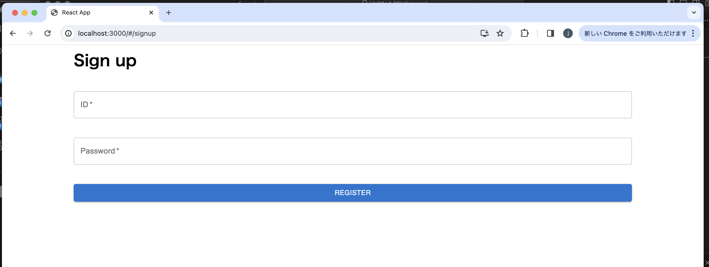

# 개발 사항

## 백엔드

- 모든 기능적 요구사항 개발완료
    - REST API 따른 로그인 API, 회원가입 API
- 모든 제약사항 준수
    - Django(django rest framework 아님) 사용 개발
    - 프론트와 통신하기 위해 Server-side rendering 아닌 REST API 통신
    - 프론트에서 접근 불가한 JWT 토큰 발급(httponly 쿠키) 
    - 코딩 컨벤션은 Django 컨벤션을 우선하되, Django 컨벤션에 없는 규약은 PEP8 준수
- 추가개발한 비기능적 사항 
    - 프론트 접근불가 JWT 토큰(httponly 쿠키) 위한, JWT 이용 인증용 API
    - 계정관리를 위한 어드민 페이지
- 사용법 및 API 소개
```
(경로 sr-test/backend에서) docker-compose up

(컨테이너 로그가 'now ready.'에서 멈추면, 컨테이너 내 경로 ~/backend에서) python manage.py runserver 0.0.0.0:8000

(이후 호스트에서 http://localhost:8001로 postman 등 API 통한 통신)


(admin 페이지 사용 위해 슈퍼유저 발급하려면, 컨테이너 내 경로 ~/backend에서) python manage.py createsuperuser

(컨테이너 내 경로 ~/backend에서) python manage.py runserver 0.0.0.0:8000

(이후 호스트에서 http://localhost:8001/admin 접속)
```
</img>

## 프론트

- 부분개발된 기능적 요구사항 
    - 로그인 페이지, 회원가입 페이지, Home 페이지 UI 
</img>
</img>
</img>
    - 로그인 페이지에서 회원가입 페이지로 라우팅 가능
    - Home 페이지의 메뉴 바 애니메이션 효과 적용
</img>
    - 다크/라이트 테마 적용 가능
</img>

- 준수한 제약사항
    - MUI v5 이용
- 추가개발한 비기능적 요구사항
    - 로그인 페이지의 fixed container 통한 자동 크기조절, 웹브라우저 자동 비밀번호
</img>
</img>
    - 회원가입 페이지의 fixed container 통한 자동 크기조절, 웹브라우저 자동 비밀번호
</img>
</img>
- 개발하지 못한 기능적 요구사항
    - 서버와 통신하여 로그인 성공/실패 메세지 출력 안됨
- 개발하지 못한 비기능적 요구사항
    - 서버와 통신하여 로그인 성공/실패 메세지 출력 후 Home 페이지 이동
- 준수하지 못한 제약사항
    - Vite 적용 안됨
- 시험 운용
```
(경로 sr-test/frontend/frontend에서) npm install

(같은 경로에서) npm start

(home UI 보려면) http://localhost:3000/#/home
```


<br>

# 고려 사항

## 백엔드

- 자동 테스트는 코드변경 등 이유로 꺠지는 코드를 탐지하기 위해 사용됩니다. 현재는 Django가 기본 제공하는 예외처리 등에 의존이 가능한 관계로 코드가 깨질 것 같지 않아 자동 테스트 코드를 작성하지 않습니다(수동 테스트로 대체함).
- HTTPS/2 사용할 예정이었음

## 프론트

- 48시간만에 제로베이스에서 어느 정도 수준까지 개발 완료(Reactjs, MUI, Vite 미경험)